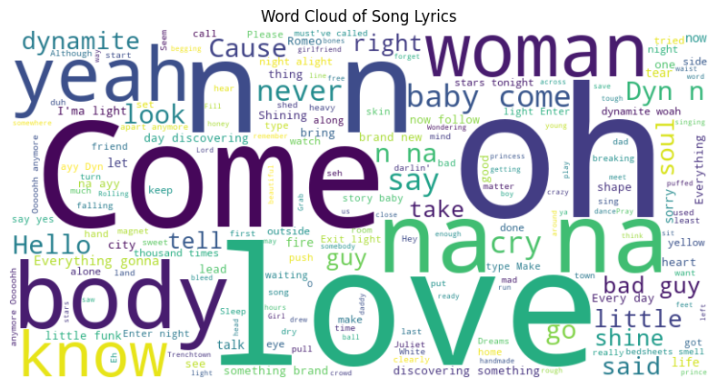

#### Module 4 Requests, JSON, and basic NLP with spaCy

_Complete the tasks in the Python Notebook in this repository.
_To be submitted for credit, all changes must be committed and pushed to this repository (do not create your own repository unless instructed to on the course website)._

#### Rubric
_* (Question 1) Lyrics printed: 1 pt_
_* (Question 1) File created and submitted with notebook: 1 pt_
_* (Question 2) Correct polarity reported: 1 pt_
_* (Question 2) Question answered thoughtfully: 1 pt_
_* (Question 3) Function defined as specified: 1 pt_
_* (Question 3) Song lyrics retrieved and stored in separate files (0.5 pts/song): 2 pts_
_* (Question 4) Polarity scores printed (with appropriate label containing song title, .25 pts/song): 1 pt_
_* (Question 4) Questions answered thoughtfully: 2 pts_
_____________________________________________________________________________________________________

# Jason A. Ballard

**Enterprise Data and AI Officer | Data Literacy Advocate | Educator in Professional Military Education**

Welcome! I'm Jason A. Ballard, an experienced data and AI integration leader currently serving as the Enterprise Data and AI Officer for Army University. My work bridges data science, AI strategy, and higher education, focusing on transforming decision-making through data literacy and innovation.

I invite you to explore my [GitHub repository](https://github.com/JBtallgrass), where I share insights, tools, and resources geared toward data literacy and advanced analytics in educational contexts. My projects emphasize practical solutions, open collaboration, and a commitment to enhancing data accessibility across teams.

## Key Areas of Focus
- **Data Strategy & Governance**: Developing frameworks that promote data-driven decision-making and cross-departmental data sharing.
- **AI & Analytics**: Leveraging data analytics and GenAI to unlock insights and drive transformational initiatives within Army University.
- **Data Literacy & Education**: Equipping leaders and students with data literacy skills critical for today's complex, data-rich environments.

Please don't hesitate to connect, collaborate, or contact me if our interests align. Let's make data-driven transformation a reality together.

## Linkedin: [Jason A. Ballard](https://linkedin.com/in/ballardjasona/) 

# Project Title: Module 4 Requests, JSON, and basic NLP with spaCy

## Project Overview
This is an academic project supporting the Masters of Science in Data Analytics program at Northwest Missouri State University [NWMSU](https://www.nwmissouri.edu/academics/graduate/masters/data-analytics.htm)
The project supports the Web Mining and Natural Language Processing course requirements.

The following Learning Objectives:
At the end of this module, students will be able to:
1. Describe the characteristics of JSON. (CO3)
2. Describe a basic Natural Language Processing Pipeline. (CO4)
3. Access web-based APIs for data. (CO2, CO3)
4. Apply basic NLP and visualize the result. (CO3, CO5, CO6)

## Table of Contents
- [Overview](#project-overview)
- [Instructions](#Instructions)
- [Questions](#Questions)
- [Commentary](#Commentary)
- [Requirements](#Requirements)
- [Installation](#installation)


## Instructions
a. Copy the base repository into your GitHub account by selecting the "Use this Template" button on GitHub and specifying yourself as the owner. The base repository is available at [https://github.com/wmnlp-materials/json-sentiment](https://github.com/wmnlp-materials/json-sentiment)
b. Clone YOUR new repo down to your machine.
c. On your machine, open the Jupyter Notebook to edit.
d. Required: After your name in your Markdown introduction, add a viewable, clickable link to your GitHub repo. You can build your brand and make your Markdown introduction clear and professional.
e. Required: Use Markdown headings (e.g., Question 1) to show your content clearly by each question number.
f. Complete the first task.
g. Execute the notebook. Commit and push to GitHub. Verify your notebook appears correctly.
h. Complete the second task.
i. Execute the notebook. Commit and push to GitHub. Verify your notebook appears correctly.
##### Work this way until all tasks have been completed. 

## Questions
* (Q1) Lyrics printed: _1 pt_

* (Q1) File created and submitted with notebook: [Birdhouse](birdhouse.pkl)

* (Q2) Correct polarity reported: _1 pt_
Sentiment Polarity Score: 0.04505208333333333
The lyrics have a positive connotation.

* (Q2) Question answered thoughtfully: _1 pt_

* (Q3) Function defined as specified: _1 pt_

* (Q3) Song lyrics retrieved and stored in separate files (0.5 pts/song): _2 pts_
Lyrics saved to [Taylor Swift, Love Story](love_story.pkl).
Lyrics saved to [Coldplay, Yellow](yellow.pkl).
Lyrics saved to [Adele, Hello](hello.pkl).
Lyrics saved to [Ed Sheeran, Shape of You](shape_of_you.pkl).

* (Q4) Polarity scores printed (with an appropriate label containing song title, .25 pts/song): _1 pt_

* (Q4) Questions answered thoughtfully: _2 pts_
| Artist | Song | File Name | Polarity Score |
|---------------|----------------|-------------------|----------------------|
| Taylor Swift | Love Story | love_story.pkl | 0.0500 |
| Coldplay | Yellow | yellow.pkl | 0.2431 |
| Adele | Hello | hello.pkl | -0.1411 |
| Ed Sheeran | Shape of You | shape_of_you.pkl | 0.3193 |

## Commentary
The polarity analysis of song lyrics provides valuable insights into their emotional tone, revealing patterns that could inform a broader project. Among the analyzed songs, Ed Sheeran's "Shape of You" (0.3193) exhibits the highest positive sentiment, suggesting its upbeat and engaging tone resonates well with audiences. Coldplay's **"Yellow" (0.2431)** reflects a cheerful but slightly more subdued sentiment, aligning with its reflective and romantic theme. In contrast, Adele's **"Hello" (-0.1411)** indicates a melancholy tone, consistent with its reflective and sorrowful narrative. Taylor Swift's **"Love Story" (0.0500)** sits near neutral, reflecting a mix of romantic optimism and conflict resolution.

## For Future Analysis
The relationships and analysis show some interesting results by exploring correlations between polarity and factors like genre, audience reception, or chart performance. Additionally, integrating visualization tools could enhance storytelling, while linking sentiment shifts within lyrics to musical transitions may provide deeper insights into how artists craft emotional journeys. This foundation offers rich potential for interdisciplinary exploration.

## Requirements
a. Markdown introduction with name and clickable link is required.
b. Markdown Section Headings for each Question are required.
c. Execute your code before exporting HTML and pushing notebooks. (See FAQ for help.)
d. Unexecuted code is not eligible for credit.

### IMPORTANT: 
Based on the outputs, I decided to conduct additional analysis and leverage knowledge gaining the Data Foundations course. The continuation analysis was continued using Generative AI resources to present coding examples and fix errors from my errors below _See Additional Analysis_

**ChatGPT 4o**  for coding, Markdown language, and errors and **Grammarly** for editing and refine/validate my initial assessments.

### Installation: 
```bash
python -m venv .env
.env\Scripts\activate
pip install -U pip setuptools wheel
pip install -U spacy
python -m spacy download en_core_web_sm
```
### Special thanks to: https://course.spacy.io/en/ 

### Additional analysis (experimentation with GenAI and foundations concepts)
[Experimental notebook](ADV-Requests-json-nlp.ipynb)

### Data Visualizations
#### Add songs


I generated titles across various genres to see a difference in the sentiment metrics. Prompt: Provide four additional songs from diverse genres.


Comments: The bar chart displays eight songs' polarity scores (sentiment), highlighting their overall emotional tone. Positive scores, such as in **Shape of You** and **No Woman No Cry**, indicate upbeat or optimistic sentiments, while negative scores, such as **Enter Sandman** and **Hello**, suggest darker or reflective moods. Songs like **Bad Guy** and **Yellow** exhibit moderate positivity. The chart clearly compares emotional polarity across the songs, emphasizing tonal differences.

#### Word Cloud

Comments: The word cloud visually represents the most frequently used words across the lyrics of the analyzed songs. More prominent words like **" na, "** **" love,"** **"know, "** and **"come"** indicate high repetition, highlighting their importance in the songs' themes and emotional tone. Words like **"baby,"** **" woman,"** **"body,"** and **"yeah"** reflect themes of relationships, emotions, and energy commonly found in pop and lyrical songs. The word cloud effectively conveys the lyrics' central ideas and recurring motifs.

#### Scatter Plot

Comments: The scatter plot compares **polarity score** (sentiment) against **word count** for eight songs. Upbeat songs like **No Woman No Cry** and **Shape of You** have high polarity and word count, reflecting their uplifting and lyrical nature. In contrast, **Enter Sandman** has low polarity and high word count, signaling a darker tone. Shorter songs like **Hello** and **Bad Guy** exhibit lower word counts with varied sentiments. The chart highlights how lyrical length correlates with emotional tone across songs.

#### Heat Map

Comments: The heatmap visualizes sentiment scores (positive, neutral, or negative) across eight songs' **Verse**, **Chorus**, and **Bridge** segments. It highlights emotional trends, such as the consistently positive sentiment in **Shape of You** and **Dynamite**, and the darker tones in **Enter Sandman**. Variability across segments is evident in songs like **Love Story**, which shifts from positive to negative in the Bridge. The heatmap reveals tonal contrasts and emotional arcs in each song's structure.
